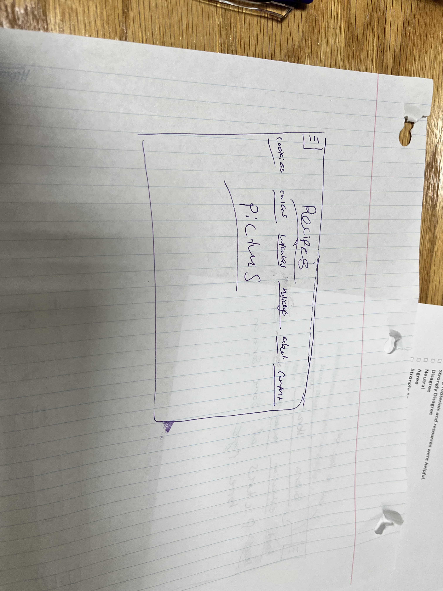

# Star Recipes

Welcome to Star Recipes! 🌟

Star Recipes is a culinary treasure trove, bringing you a delightful collection of tried-and-true recipes from around the world. Whether you're a seasoned chef or a novice in the kitchen, you'll find inspiration and guidance to elevate your culinary creations.

## Table of Contents

- [Features](#features)
- [Getting Started](#getting-started)
- [Usage](#usage)
- [Contributing](#contributing)
- [License](#license)

## Features

- **Diverse Recipes**: Explore a vast array of recipes, from appetizers and main courses to desserts and beverages. We have something for every taste and occasion.

- **Detailed Instructions**: Each recipe comes with clear, step-by-step instructions, along with ingredient lists and helpful cooking tips.

- **User-Friendly Interface**: Our user-friendly website makes it easy to find, save, and share your favorite recipes.

- **Search Functionality**: Quickly find recipes by name, ingredients, or cuisine.

- **Community and Feedback**: Join our passionate cooking community, share your culinary achievements, and exchange ideas.

- **Baking Basics**: New to cooking? Our "Cooking Basics" section provides essential tips, techniques, and equipment recommendations.

You can use Star Recipes to:

- Discover new recipes and cooking ideas.
- Search for specific recipes or ingredients.
- Save your favorite recipes for easy access.
- Share your own culinary masterpieces with the community.

## Contributing

We welcome contributions from the community to make Star Recipes even better. If you'd like to contribute, please follow these guidelines:

1. Fork the repository.
2. Create a branch for your feature or bug fix: `git checkout -b feature/your-feature-name`
3. Make your changes and commit them: `git commit -m 'Add new feature'`
4. Push to your fork: `git push origin feature/your-feature-name`
5. Open a pull request.

## License

This project is licensed under the MIT License - see the [LICENSE.md](LICENSE.md) file for details.

---

Thank you for choosing Star Recipes to enhance your culinary journey. If you have any questions or feedback, please don't hesitate to reach out. Happy cooking! 🍽️

##Screenshot

